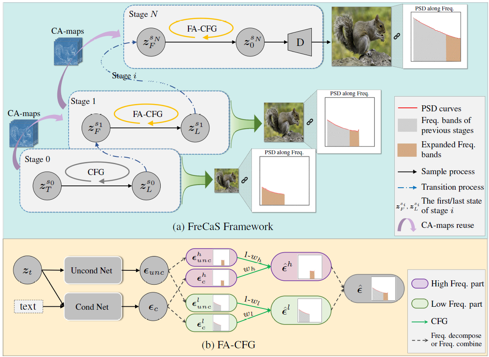

### :star: Update
- **2025.02.24**: Accepted by [ICLR2025](https://iclr.cc/Conferences/2025). We update the code for SD21 and SD3 pretrained models.

---

### [FreCaS: Efficient Higher-Resolution Image Generation via Frequency-aware  Cascaded Sampling (ICLR2025)](https://arxiv.org/abs/2410.18410)


<a href='https://arxiv.org/abs/2410.18410'></a>

[Zhengqiang Zhang](https://scholar.google.com.hk/citations?hl=zh-CN&user=UX26wSMAAAAJ)<sup>1,2</sup> | [Ruihuang Li](https://scholar.google.com.hk/citations?user=8CfyOtQAAAAJ&hl=zh-CN&oi=ao) <sup>1,2</sup> | [Lei Zhang](https://scholar.google.com.hk/citations?hl=zh-CN&user=tAK5l1IAAAAJ)<sup>1,2</sup>

<sup>1</sup>The Hong Kong Polytechnic University, <sup>2</sup> The PolyU-OPPO Joint Innovation Lab


**ABSTRACT** While image generation with diffusion models has achieved a great success, generating images of higher resolution than the training size remains a challenging task due to the high computational cost. Current methods typically perform the entire sampling process at full resolution and process all frequency components simultaneously, contradicting with the inherent coarse-to-fine nature of latent diffusion models and wasting computations on processing premature high-frequency details at early diffusion stages. To address this issue, we introduce an efficient **Fre**quency-aware **Ca**scaded **S**ampling framework, **FreCaS** in short, for higher-resolution image generation. FreCaS decomposes the sampling process into cascaded stages with gradually increased resolutions, progressively expanding frequency bands and refining the corresponding details. We propose an innovative frequency-aware classifier-free guidance (FA-CFG) strategy to assign different guidance strengths for different frequency components, directing the diffusion model to add new details in the expanded frequency domain of each stage. Additionally, we fuse the cross-attention maps of previous and current stages to avoid synthesizing unfaithful layouts. Experiments demonstrate that FreCaS significantly outperforms state-of-the-art methods in image quality and generation speed. In particular, FreCaS is about 2.86&times; and 6.07&times; faster than ScaleCrafter and DemoFusion in generating a 2048&times;2048 image using a pre-trained SDXL model and achieves an FID<sub>b</sub> improvement of 11.6 and 3.7, respectively. FreCaS can be easily extended to more complex models such as SD3.

## FreCaS && FA-CFG



(a) The overall framework of FreCaS. The entire **T**-step sampling process is divided into **N+1** stages of increasing resolutions and expanding frequency bands. FreCaS starts the sampling process at the training size and obtains the last latent z<sup>s<sub>0</sub></sup><sub>L</sub> at that stage. Then, FreCaS continues the sampling from the first latent z<sup>s<sub>1</sub></sup><sub>F</sub> at the next stage with a larger resolution and expanded frequency domain. This procedure is repeated until the final latent z<sup>s<sub>N</sub></sup><sub>0</sub> at stage **N** is obtained. A decoder is then used to generate the final image.

(b) FA-CFG strategy. FreCaS leverages the FA-CFG strategy to direct diffusion models more on generating contents of expanded frequency bands. We separate the original denoising scores into low-frequency and high-frequency components and assign a higher CFG strength to the high-frequency part. The two parts are then combined to obtain the final denoising score .


---

## HOW TO USE

- ##### Download pre-trained models
  Please download the pre-trained models from huggingface.
  
  The mode of SD21: [https://huggingface.co/stabilityai/stable-diffusion-2-1](https://huggingface.co/stabilityai/stable-diffusion-2-1)
  
  The model of SDXL: [https://huggingface.co/stabilityai/stable-diffusion-xl-base-1.0](https://huggingface.co/stabilityai/stable-diffusion-xl-base-1.0)
  
  The model of SD3: [https://huggingface.co/stabilityai/stable-diffusion-3-medium](https://huggingface.co/stabilityai/stable-diffusion-3-medium)
  
  Then, just modify the paths in "main.py".
```
    pipeline_paths = {
        "sd21": "/home/notebook/data/sharedgroup/RG_YLab/aigc_share_group_data/LowLevelLLM/models/diffusion_models/stable-diffusion-2-1-base",
        "sdxl": "/home/notebook/data/group/LowLevelLLM/models/diffusion_models/stable-diffusion-xl-base-1.0",
        "sd3": "/home/notebook/data/group/LowLevelLLM/models/diffusion_models/stable-diffusion-3-medium-diffusers",
    }
```
  
- ##### Inference
Please use the following command to generate higher-resolution images:
```
python3 main.py 
    --name [sd21/sdxl/sd3] # the name of pre-trained models
    --output xxx # output dir
    --prompts ["xxx"|prompts.lst] # a string or prompt file
    --images-per-prompt xx #
    --gs xxx # the guidance scale for CFG in the first stage
    
    # settings for FreCaS
    --tsize [[h1,w1],[h2,w2]] # the sizes of each stage
    --msp_endtimes t1 t2 # the end timestep of each stage
    --msp_steps step1 step2 # the inference steps for each stage
    
    # settings for FA-CFG
    --facfg_weight wh wl # the guidance strength of high-/low-frequency compoents, respectively
    
    # settings for CA-maps reuse
    --camap_weight wc # the wc for CA-map reuse
```

    One example of generating figures of 2048x2048 using SDXL models.
    `python3 main.py --gs 7.5 --prompts prompts.lst --tsize [[1024,1024],[2048,2048]] --msp_endtimes 200 0 --msp_steps 40 10 --msp_gamma 1.5 --name sdxl --images-per-prompt 1 --facfg_weight 25.0 7.5 --camap_weight 0.8 --output results`
    

*You can adjust the steps/endtimestep of each stages, the guidance strength of each frequency components w<sub>h</sub> and w<sub>l</sub>, or CA-maps reutilization weight w<sub>c</sub> to seek a better tradeoff between quality and efficiency.*


## CITATION

```
@inproceedings{zhang2024frecas,
  title={FreCaS: Efficient Higher-Resolution Image Generation via Frequency-aware Cascaded Sampling},
  author={Zhang, Zhengqiang and Li, Ruihuang and Zhang, Lei},
  booktitle={The Thirteenth International Conference on Learning Representations}
}
```

### CONTACT

Please leave a issue or contact zhengqiang with [zhengqiang.zhang@connect.polyu.hk](mailto:zhengqiang.zhang@connect.polyu.hk)

## License
This project is released under the [Apache 2.0 license](https://www.apache.org/licenses/LICENSE-2.0.html).


